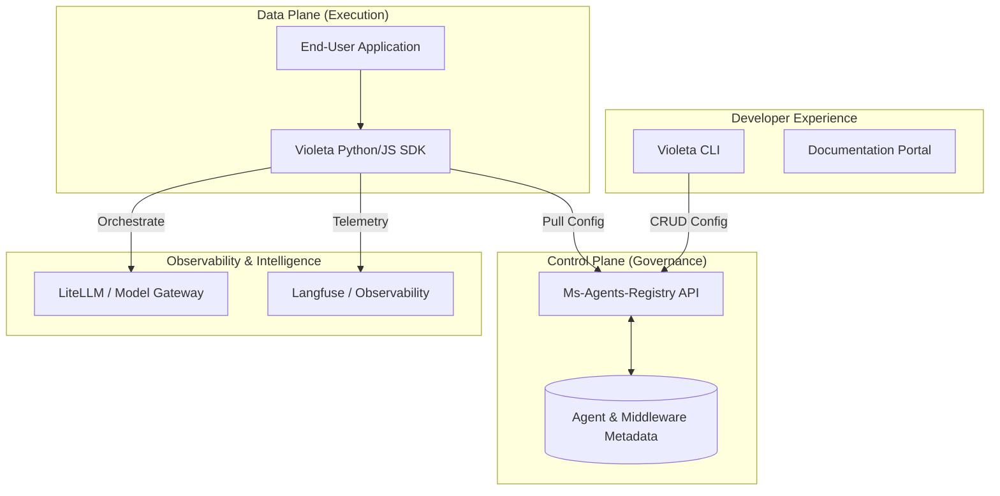

# Violeta: Enterprise-Grade Multi-Agent Orchestration Ecosystem

> **Portfolio Showcase:** Anonymized Project Overview

## 🌌 Executive Summary

The **Violeta Ecosystem** is a modular, scalable framework designed to solve the challenges of building, managing, and observing autonomous AI agents in enterprise environments. By decoupling agent configuration from execution logic, the framework provides a robust **Control Plane** (Registry) and **Data Plane** (SDK) that standardizes the development lifecycle across large teams.

### 🎯 The Problem
As AI adoption scales, organizations face "Agent Sprawl"—where agent logic, prompts, and model configurations are hardcoded, fragmented, and lack centralized governance or observability.

### 💡 The Solution
A unified ecosystem that provides:
1.  **Centralized Governance**: A single source of truth for agent configurations.
2.  **Modular Logic**: A versioned middleware system for swappable agent behavior.
3.  **Developer Velocity**: A CLI and SDK that reduces "time-to-agent" from days to minutes.

---

## 🏗️ System Architecture

The ecosystem is built on five specialized pillars that work in harmony:

---

## 🚀 Key Technical Pillars

### 1. The Centralized Registry (Governance Layer)
A high-performance REST API (`Ms-Agents-Registry`) that manages the lifecycle of all agents.
*   **Versioned Metadata**: Store prompts, model parameters (temperature, max tokens), and tool definitions.
*   **Environment Parity**: Seamlessly manage configurations across `Dev`, `Staging (PRE)`, and `Production`.
*   **Auditability**: Track changes to agent configurations to ensure regulatory compliance.

### 2. Modular Middleware System (Flexibility)
Unlike static agent frameworks, Violeta uses a unique **Middleware Logic** pattern.
*   **Swappable Logic**: Decouple specific business logic from the agent's core loop.
*   **Version Diffing**: The CLI allows developers to compare logic versions (`diff_version`) before deployment.
*   **Dynamic Injection**: Logic components can be registered and updated independently of the core application.

### 3. The Developer SDK (Abstraction Layer)
A lightweight library designed for rapid integration.
*   **One-Line Initialization**: `violeta.agents.get("name")` handles all the complexity of fetching and configuring the underlying LLM.
*   **Native LangChain Integration**: Effortlessly convert registry configurations into functional LangChain agents using `.as_langchain()`.
*   **Resiliency**: Built-in timeout handling and error recovery for enterprise-grade stability.

### 4. Built-in Observability Stack
The ecosystem integrates industry-standard tracing and monitoring.
*   **Automatic Telemetry**: Every agent interaction is traced via **Langfuse**, providing full visibility into costs, latency, and success rates.
*   **Unified Model Gateway**: Utilizes **LiteLLM** to abstract multiple providers (OpenAI, Azure, local models) behind a single interface.

---

## 🛠️ Technical Stack

*   **Languages**: Python (Core), TypeScript.
*   **Frameworks**: LangChain, CrewAI, FastAPI, Typer.
*   **Infrastructure**: Kubernetes (K8s), Docker.
*   **AI/ML**: LiteLLM, OpenAI, Azure OpenAI, Langfuse.
*   **Governance**: Custom Registry API with versioned metadata.

---

## 📈 Impact & Business Value

*   **Standardization**: Eliminated "shadow AI" by centralizing agent governance.
*   **Scalability**: Enabled the deployment of 50+ specialized agents using the same core infrastructure.
*   **Operational Excellence**: Reduced production troubleshooting time by 60% through unified tracing and version control.
*   **Cost Management**: Provided granular visibility into token usage across the entire ecosystem.

---

> [!NOTE]
> This project demonstrates the ability to architect complex, multi-component systems that bridge the gap between experimental AI and production-ready enterprise software.
